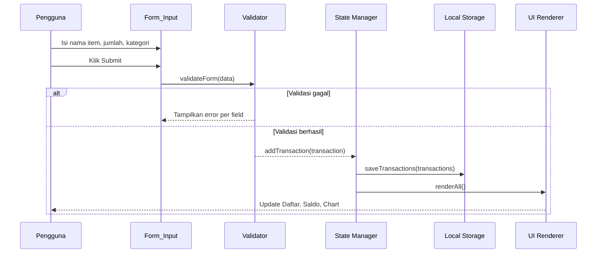
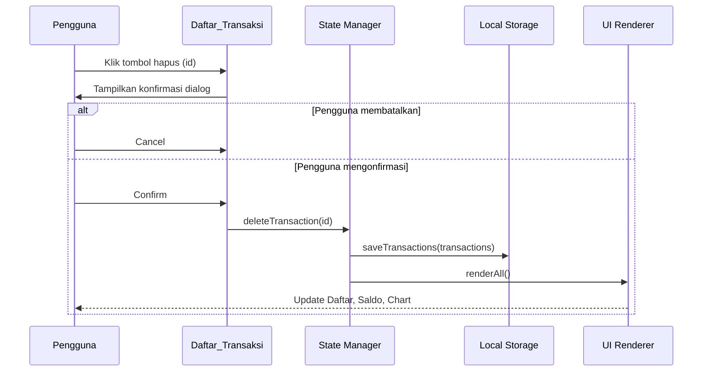

# Design Document

## Expense & Budget Visualizer

---

## Overview

Expense & Budget Visualizer adalah aplikasi web satu halaman (_single-page application_) yang dibangun sepenuhnya menggunakan HTML, CSS, dan Vanilla JavaScript murni — tanpa framework, tanpa bundler, dan tanpa backend server. Semua data tersimpan di _browser Local Storage_ sehingga aplikasi berfungsi penuh secara _offline_.

Arsitektur aplikasi mengikuti pola **MVC ringan berbasis modul** (Vanilla JS modules via `<script type="module">`): satu file HTML sebagai kerangka struktur, satu file CSS untuk presentasi, dan satu file JavaScript yang dipecah secara logis ke dalam modul-modul internal menggunakan ES Modules. Karena hanya ada satu file JS yang di-`import` dari HTML (sesuai Persyaratan 6.3), seluruh modul internal di-bundle secara konseptual di dalam satu file `js/app.js`.

Prinsip utama desain:
- **Pemisahan tanggung jawab** — logika validasi, penyimpanan, dan rendering dipisahkan ke dalam fungsi/modul yang jelas.
- **Reaktivitas berbasis event** — perubahan state ditransmisikan melalui _custom event_ atau pemanggilan fungsi `render` langsung agar UI selalu sinkron dengan data.
- **Zero dependency runtime** — Chart.js dimuat via CDN; tidak ada dependensi `npm` lainnya.

---

## Architecture

### Gambaran Arsitektur Tingkat Tinggi

```
┌─────────────────────────────────────────────────────┐
│                    index.html                        │
│  ┌──────────────────────────────────────────────┐   │
│  │               js/app.js (entry point)         │   │
│  │                                               │   │
│  │  ┌──────────┐  ┌──────────┐  ┌───────────┐  │   │
│  │  │  storage │  │validator │  │  formatter │  │   │
│  │  │  module  │  │  module  │  │   module   │  │   │
│  │  └────┬─────┘  └────┬─────┘  └─────┬─────┘  │   │
│  │       │             │              │          │   │
│  │  ┌────▼─────────────▼──────────────▼──────┐  │   │
│  │  │              state manager              │  │   │
│  │  │  (in-memory array of Transactions)      │  │   │
│  │  └──────────────────┬──────────────────────┘  │   │
│  │                     │                          │   │
│  │  ┌──────────────────▼──────────────────────┐  │   │
│  │  │              UI renderer                 │  │   │
│  │  │  renderTransactionList()                 │  │   │
│  │  │  renderTotalSaldo()                      │  │   │
│  │  │  renderChart()          (Chart.js)       │  │   │
│  │  │  renderMonthlySummary() (optional)       │  │   │
│  │  └─────────────────────────────────────────┘  │   │
│  └───────────────────────────────────────────────┘   │
│                                                       │
│  css/style.css          Chart.js (CDN)               │
└─────────────────────────────────────────────────────┘
```

### Alur Data Utama



### Alur Hapus Transaksi



---

## Components and Interfaces

### 1. `StorageManager`

Bertanggung jawab atas seluruh interaksi dengan `localStorage`.

```javascript
// Interface StorageManager
StorageManager.save(key: string, data: any): void
StorageManager.load(key: string): any | null
StorageManager.isAvailable(): boolean
```

- **`save`**: Serialisasi `data` ke JSON dan tulis ke `localStorage[key]`. Jika gagal (misalnya storage penuh atau tidak tersedia), lempar error yang ditangkap pemanggil untuk menampilkan notifikasi.
- **`load`**: Baca dan parse JSON dari `localStorage[key]`. Kembalikan `null` jika key tidak ada. Jika JSON tidak valid, lempar `StorageParseError`.
- **`isAvailable`**: Deteksi ketersediaan `localStorage` dengan percobaan `setItem`/`removeItem`.

Konstanta kunci storage:
```javascript
const STORAGE_KEY_TRANSACTIONS = 'ebv_transactions';
const STORAGE_KEY_THEME        = 'ebv_theme';
const STORAGE_KEY_THRESHOLD    = 'ebv_threshold';
```

---

### 2. `Validator`

Fungsi-fungsi validasi murni (pure functions) tanpa side effect.

```javascript
// Interface Validator
Validator.validateNamaItem(value: string): { valid: boolean, error: string }
Validator.validateJumlah(value: string | number): { valid: boolean, error: string }
Validator.validateKategori(value: string): { valid: boolean, error: string }
Validator.validateThreshold(value: string | number): { valid: boolean, error: string }
Validator.validateTransactionData(data: object): { valid: boolean, errors: object }
```

Aturan validasi:
- `namaItem`: wajib diisi, non-kosong setelah trim, maksimal 100 karakter.
- `jumlah`: wajib diisi, angka integer positif, 1 ≤ jumlah ≤ 999.999.999.
- `kategori`: wajib diisi, harus salah satu dari `['Makanan', 'Transportasi', 'Hiburan']`.
- `threshold`: angka integer, 0 ≤ threshold ≤ 999.999.999.

---

### 3. `Formatter`

Fungsi pemformatan angka ke string Rupiah.

```javascript
// Interface Formatter
Formatter.toRupiah(amount: number): string
// Contoh: Formatter.toRupiah(150000) → "Rp 150.000"
// Contoh: Formatter.toRupiah(0)      → "Rp 0"
```

Implementasi menggunakan `Intl.NumberFormat` dengan locale `id-ID` atau pemformatan manual dengan pemisah titik.

---

### 4. `StateManager`

Mengelola array transaksi di memori dan menjadi sumber kebenaran tunggal (_single source of truth_).

```javascript
// Interface StateManager
StateManager.getTransactions(): Transaction[]
StateManager.addTransaction(data: TransactionInput): Transaction
StateManager.deleteTransaction(id: string): void
StateManager.getTotal(): number
StateManager.getByCategory(): { [kategori: string]: number }
StateManager.getByMonth(): { [yearMonth: string]: number }
StateManager.loadFromStorage(): void
StateManager.persistToStorage(): void
```

---

### 5. UI Renderer Functions

Kumpulan fungsi yang melakukan DOM manipulation untuk memperbarui tampilan.

```javascript
renderTransactionList(transactions: Transaction[]): void
renderTotalSaldo(total: number): void
renderChart(byCategory: object): void
renderMonthlySummary(byMonth: object): void   // opsional
renderEmptyState(): void
showNotification(message: string, type: 'success' | 'error', duration?: number): void
showFieldError(fieldId: string, message: string): void
clearFieldErrors(): void
```

---

### 6. `ThemeManager` _(Opsional)_

```javascript
ThemeManager.apply(theme: 'terang' | 'gelap'): void
ThemeManager.toggle(): void
ThemeManager.getPreferred(): 'terang' | 'gelap'
```

Bekerja dengan menambah/menghapus class `dark-mode` pada elemen `<body>` dan menyimpan preferensi ke `StorageManager`.

---

## Data Models

### Tipe `Transaction`

```javascript
/**
 * @typedef {Object} Transaction
 * @property {string}  id        - UUID v4 atau timestamp-based unique string
 * @property {string}  namaItem  - Nama item pengeluaran (max 100 karakter)
 * @property {number}  jumlah    - Jumlah pengeluaran dalam Rupiah (integer, 1–999999999)
 * @property {string}  kategori  - 'Makanan' | 'Transportasi' | 'Hiburan'
 * @property {string}  tanggal   - ISO 8601 date string (e.g. "2024-09-14T08:30:00.000Z")
 */
```

### Contoh Data JSON di Local Storage

```json
[
  {
    "id": "1694678400000-abc12",
    "namaItem": "Nasi Padang",
    "jumlah": 25000,
    "kategori": "Makanan",
    "tanggal": "2024-09-14T08:30:00.000Z"
  },
  {
    "id": "1694764800000-def34",
    "namaItem": "Grab ke Kantor",
    "jumlah": 18000,
    "kategori": "Transportasi",
    "tanggal": "2024-09-15T07:45:00.000Z"
  }
]
```

### Generasi ID Unik

```javascript
function generateId() {
  return `${Date.now()}-${Math.random().toString(36).slice(2, 7)}`;
}
```

Pendekatan ini cukup untuk aplikasi client-side karena tidak ada multi-user concurrency.

### State Derived dari `Transaction[]`

Semua nilai UI yang ditampilkan diderivasi dari array `transactions`:

| Derived State | Cara Kalkulasi |
|---|---|
| `total` | `transactions.reduce((sum, t) => sum + t.jumlah, 0)` |
| `byCategory` | `group by t.kategori → sum t.jumlah` |
| `byMonth` | `group by t.tanggal.slice(0,7) → sum t.jumlah` |

### Skema Data Tambahan di Local Storage

```javascript
// Preferensi tema (opsional)
localStorage.setItem('ebv_theme', '"gelap"'); // JSON-encoded string

// Nilai threshold highlight (opsional)
localStorage.setItem('ebv_threshold', '500000'); // JSON-encoded number
```

---

### Struktur File Proyek

```
project-root/
├── index.html
├── css/
│   └── style.css
└── js/
    └── app.js
```

Semua logika (StorageManager, Validator, Formatter, StateManager, UI renderers, ThemeManager) ditulis dalam satu file `js/app.js` yang diorganisasi menjadi beberapa _section_ dengan komentar blok yang jelas.

---

## Correctness Properties

*A property is a characteristic or behavior that should hold true across all valid executions of a system — essentially, a formal statement about what the system should do. Properties serve as the bridge between human-readable specifications and machine-verifiable correctness guarantees.*

### Property 1: Validator menolak input `jumlah` di luar rentang yang valid

*For any* nilai input `jumlah` yang bukan angka positif integer atau berada di luar rentang [1, 999.999.999] (termasuk angka negatif, nol, angka di atas batas, dan string non-numerik), fungsi `Validator.validateJumlah` SHALL selalu mengembalikan `{ valid: false }`.

**Validates: Requirements 1.4**

---

### Property 2: Validator menolak `namaItem` yang kosong atau whitespace-only

*For any* string yang terdiri sepenuhnya dari karakter whitespace (spasi, tab, newline — termasuk string kosong `""`), fungsi `Validator.validateNamaItem` SHALL selalu mengembalikan `{ valid: false }`.

**Validates: Requirements 1.2, 1.3**

---

### Property 3: Penambahan transaksi valid memperbesar daftar tepat satu item

*For any* daftar transaksi dan data input yang lolos validasi, memanggil `StateManager.addTransaction(data)` SHALL menghasilkan daftar baru yang panjangnya bertambah tepat satu dari daftar sebelumnya.

**Validates: Requirements 1.5, 3.1**

---

### Property 4: Penghapusan transaksi menghilangkan item yang tepat dari daftar

*For any* daftar transaksi yang berisi setidaknya satu item, memanggil `StateManager.deleteTransaction(id)` dengan id yang ada dalam daftar SHALL menghasilkan daftar yang panjangnya berkurang tepat satu dan tidak lagi mengandung transaksi dengan id tersebut.

**Validates: Requirements 3.3, 3.4**

---

### Property 5: Total saldo selalu sama dengan penjumlahan semua nilai `jumlah`

*For any* daftar transaksi (termasuk daftar kosong), `StateManager.getTotal()` SHALL mengembalikan nilai yang persis sama dengan akumulasi `t.jumlah` dari seluruh item dalam daftar. Untuk daftar kosong, hasilnya adalah `0`.

**Validates: Requirements 4.1, 4.5**

---

### Property 6: Serialisasi round-trip mempertahankan seluruh data transaksi

*For any* array `Transaction[]` yang valid (termasuk array kosong dan array dengan berbagai ukuran), menyerialkannya ke JSON lalu mem-parse hasilnya kembali SHALL menghasilkan array yang secara struktural identik — setiap properti `id`, `namaItem`, `jumlah`, `kategori`, dan `tanggal` harus sama persis dengan nilai awal.

**Validates: Requirements 2.1, 2.3, 2.5**

---

### Property 7: Format Rupiah selalu konsisten untuk semua angka non-negatif

*For any* bilangan integer non-negatif `n`, `Formatter.toRupiah(n)` SHALL menghasilkan string yang (a) diawali dengan `"Rp "`, (b) menggunakan titik sebagai pemisah ribuan, dan (c) tidak mengandung koma atau desimal apapun.

**Validates: Requirements 3.1, 4.4**

---

### Property 8: `getByCategory` hanya mengandung kategori dengan total pengeluaran lebih dari nol

*For any* daftar transaksi, `StateManager.getByCategory()` SHALL tidak menyertakan entri apapun dengan nilai total `0` atau kurang — hanya kategori yang memiliki setidaknya satu transaksi SHALL muncul dalam hasil.

**Validates: Requirements 5.1**

---

### Property 9: `getByMonth` mengelompokkan berdasarkan kombinasi bulan-dan-tahun secara akurat

*For any* daftar transaksi dengan tanggal yang bervariasi (termasuk transaksi di bulan yang sama pada tahun berbeda), `StateManager.getByMonth()` SHALL (a) mengelompokkan transaksi berdasarkan kombinasi unik bulan dan tahun sehingga bulan yang sama pada tahun berbeda menjadi entri terpisah, (b) hanya menyertakan bulan yang memiliki setidaknya satu transaksi, dan (c) mengembalikan entri diurutkan dari bulan terbaru ke terlama.

**Validates: Requirements 7.1, 7.3**

---

### Property 10: Validator threshold menolak semua nilai di luar rentang [0, 999.999.999]

*For any* nilai input threshold yang bukan angka atau berada di luar rentang [0, 999.999.999] (termasuk angka negatif, angka di atas batas, dan string non-numerik), `Validator.validateThreshold` SHALL mengembalikan `{ valid: false }` sehingga nilai threshold yang tersimpan tidak berubah.

**Validates: Requirements 9.3**

---

## Error Handling

### Strategi Penanganan Error Berdasarkan Lapisan

| Lapisan | Jenis Error | Penanganan |
|---|---|---|
| **Validator** | Input tidak valid | Tampilkan pesan error di bawah field yang bermasalah (inline); tidak melempar exception |
| **StorageManager (write)** | `localStorage` penuh / tidak tersedia | Catch `DOMException`, tampilkan notifikasi `"Data tidak dapat disimpan secara persisten"` selama ≥ 3 detik |
| **StorageManager (read)** | JSON corrupt / parse error | Catch `SyntaxError`, hapus key yang rusak, mulai dengan array kosong, tampilkan notifikasi `"Data sebelumnya tidak dapat dimuat"` |
| **Chart.js** | Library tidak termuat dari CDN | Tampilkan placeholder teks di kontainer chart |
| **Umum** | Error tak terduga | `window.onerror` / `window.onunhandledrejection` mencatat ke konsol; UI tidak crash |

### Notifikasi

Notifikasi ditampilkan sebagai _toast_ yang muncul di pojok layar, menggunakan class CSS untuk animasi masuk/keluar, dan menghilang otomatis setelah durasi yang ditentukan (default 3 detik, dapat dikonfigurasi).

```javascript
// Contoh pemanggilan
showNotification('Transaksi berhasil ditambahkan!', 'success', 3000);
showNotification('Data tidak dapat disimpan secara persisten.', 'error', 4000);
```

---

## Testing Strategy

### Pendekatan Dual Testing

Strategi pengujian menggabungkan:
1. **Unit tests (example-based)** — menguji skenario spesifik dan edge case.
2. **Property-based tests (PBT)** — memvalidasi properti universal di berbagai kombinasi input.

Keduanya bersifat komplementer: unit tests menangkap bug konkret, PBT memverifikasi kebenaran umum.

### Library PBT

Gunakan **[fast-check](https://fast-check.dev/)** untuk property-based testing, dimuat via CDN atau melalui `<script>` tag dalam test harness HTML. Setiap property test dijalankan dengan **minimum 100 iterasi**.

### Unit Tests (Example-Based)

Fokus pada:
- Skenario sukses penambahan transaksi dengan data valid.
- Skenario penghapusan transaksi dengan konfirmasi.
- Skenario error: semua field kosong, jumlah negatif, jumlah melebihi batas.
- Perilaku saat `localStorage` tidak tersedia.
- Perilaku saat data di `localStorage` corrupt.
- Tampilan _empty state_ saat tidak ada transaksi.
- Pemformatan Rupiah: `0`, `1.000`, `999.999.999`.

### Property-Based Tests

Setiap property test harus menyertakan tag komentar referensi:

```
// Feature: expense-budget-visualizer, Property {n}: {judul property}
```

| Property | Deskripsi Singkat | Generator Input |
|---|---|---|
| **Property 1** | Validator menolak `jumlah` di luar rentang [1, 999999999] | Angka acak di luar rentang dan string non-numerik |
| **Property 2** | Validator menolak `namaItem` whitespace-only | String whitespace acak (spasi, tab, newline, kombinasinya) |
| **Property 3** | Penambahan transaksi valid menambah panjang daftar +1 | Array transaksi acak + data input valid acak |
| **Property 4** | Penghapusan transaksi menghilangkan item yang tepat -1 | Array transaksi acak (min 1 item), pilih id acak dari dalamnya |
| **Property 5** | Total saldo = sum semua `jumlah` (termasuk array kosong) | Array transaksi acak dengan jumlah integer acak |
| **Property 6** | Serialisasi round-trip mempertahankan semua properti | Array transaksi acak (berbagai ukuran, termasuk kosong) |
| **Property 7** | Format Rupiah selalu `"Rp "` + angka dengan pemisah titik | Integer non-negatif acak (termasuk 0 dan batas atas) |
| **Property 8** | `getByCategory` hanya memuat kategori dengan total > 0 | Array transaksi acak (subset acak dari 3 kategori) |
| **Property 9** | `getByMonth` mengelompokkan per bulan-tahun dan diurutkan | Array transaksi acak dengan tanggal ISO acak |
| **Property 10** | Validator threshold menolak nilai di luar [0, 999999999] | Angka di luar rentang, negatif, dan string non-numerik |

### Pengujian Manual (Browser)

Karena aplikasi bersifat client-side dan merender DOM, sebagian pengujian dilakukan secara manual:
- Verifikasi rendering chart saat transaksi ditambah/dihapus.
- Verifikasi scrollable list saat > 6 item.
- Verifikasi tooltip pada hover irisan chart.
- Verifikasi responsivitas di Chrome, Firefox, Edge, dan Safari.
- Verifikasi performa render awal < 3 detik.
- Verifikasi waktu respons UI < 100ms (secara subjektif/DevTools).
- Pengujian mode gelap/terang (opsional).
